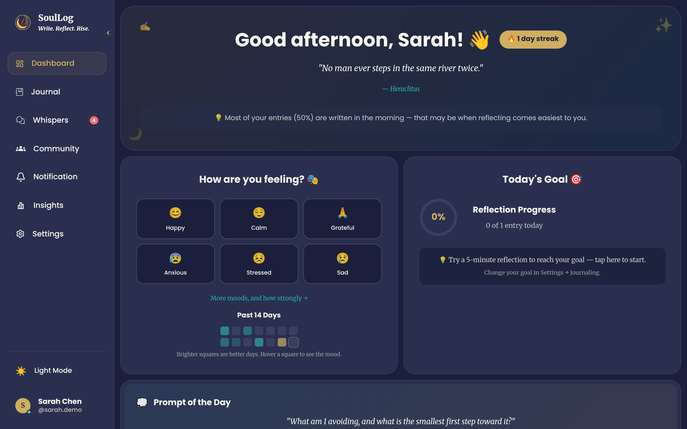
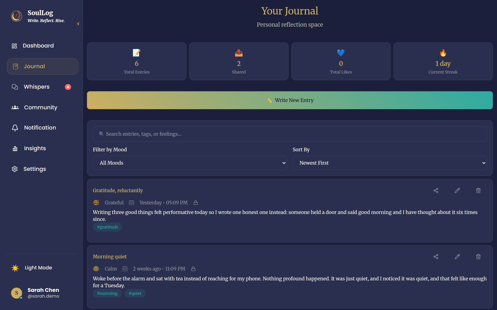
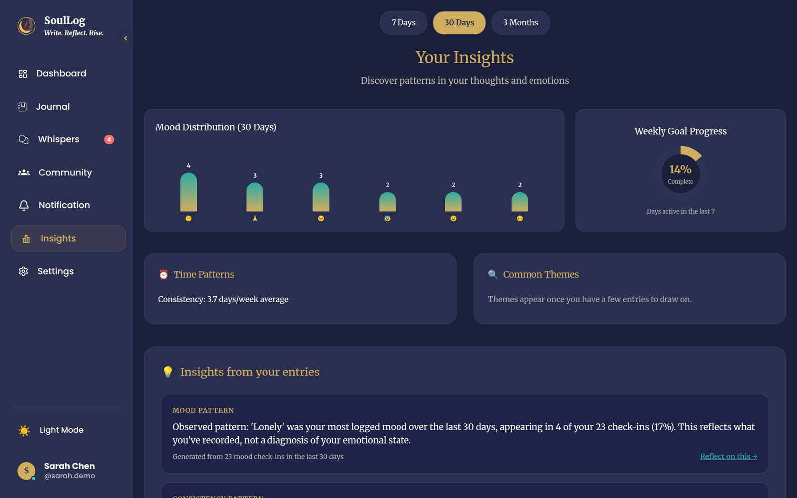
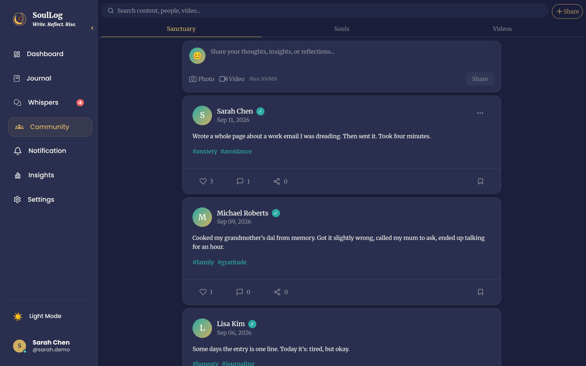
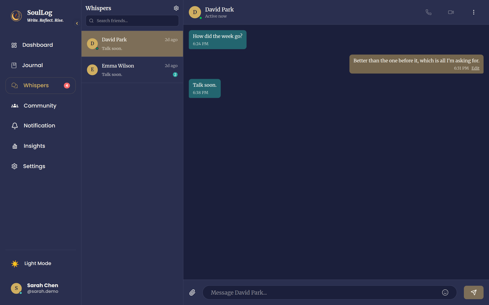
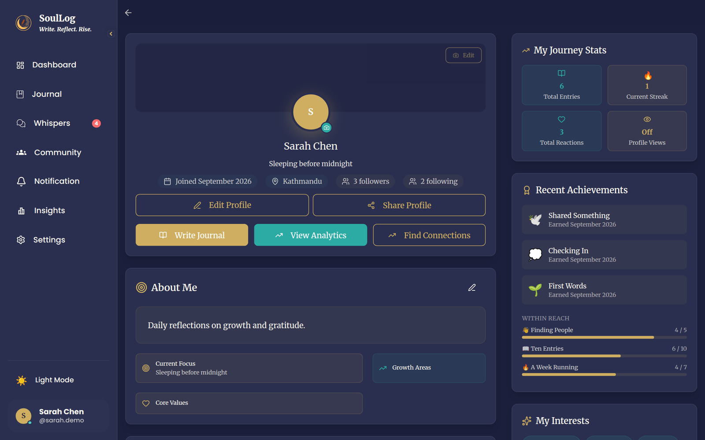
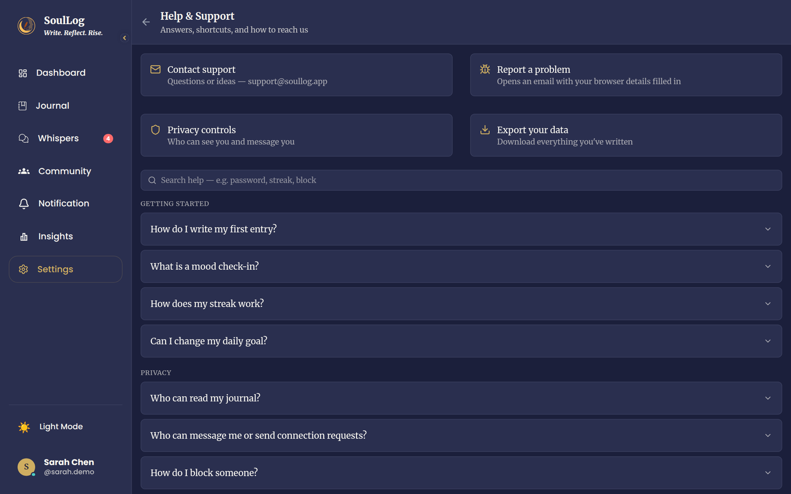
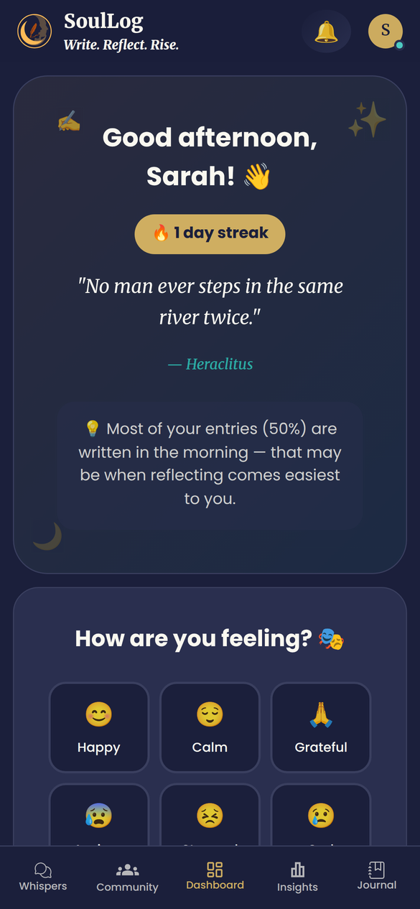

# SoulLog

*Write. Reflect. Rise.*

A private wellness and journaling platform with an optional, carefully
scoped social layer — journal entries, mood check-ins, and personal
insights generated from your own real data. Not a generic diary app, and
not a generic social network.

This started as a polished pre-MVP frontend with mocked data and a small
real backend footprint. It is now a full-stack product: the screens are
backed by real data, and the things that aren't built are written down
rather than faked.

| | |
|---|---|
| **Backend** | Django 5.2 · Django REST Framework · Channels (WebSockets) · PostgreSQL 16 · Redis (optional) · JWT auth |
| **Frontend** | React 19 · TypeScript (strict, no `any`) · Vite 7 · Tailwind CSS 4 |
| **Mobile** | Capacitor 7 — Android and iOS from the same codebase |
| **Quality** | 231 backend tests incl. real WebSocket tests · GitHub Actions CI (Postgres, deploy checks, Android build, Docker) |
| **Ops** | Docker Compose · gunicorn + uvicorn workers · WhiteNoise · S3-ready media storage · optional Sentry |

## Screenshots

<p align="center">
  
</p>

| Journal | Insights |
|---|---|
|  |  |

| Community (Sanctuary) | Whispers — real-time messages |
|---|---|
|  |  |

| Profile & badges | Help & Support |
|---|---|
|  |  |

<p align="center">
  <br>
  <sub>The same app on a phone (Capacitor build).</sub>
</p>

<sub>Screenshots use the built-in demo account and demo data.</sub>

## Quick start (macOS)

```bash
./scripts/setup-mac.sh   # once: installs what's missing, creates the database, seeds demo data
./scripts/dev.sh         # every time: API on :8000 and the app on :5173
```

Open <http://localhost:5173> and create an account. (Want sample data to look around? `python manage.py seed_demo` adds demo accounts; `clear_demo` removes them.)
Other platforms and Docker: see [`SETUP.md`](SETUP.md).

### On your phone (iPhone or Android)

```bash
./scripts/dev-phone.sh   # instead of dev.sh
```

It prints a temporary `https://….trycloudflare.com` address and a QR code.
Scan it with the phone's camera (any Wi-Fi, or mobile data), then use
**Share → Add to Home Screen** (iPhone) or **⋮ → Add to Home screen**
(Android) to open SoulLog full-screen from its own icon. The address is
public while the script runs and changes every time; Ctrl+C stops it.

## What's real

**Private by default.** Journaling with photo and voice attachments,
mood check-ins, and three visibility levels that are enforced in the
database layer — `private` means only you, `connections` means an
accepted mutual connection (following someone is not enough), `community`
means any signed-in user. Anything you aren't entitled to see returns a
404, not a 403, because a 403 confirms it exists.

**Insights you can check.** Six analyzers read only your own entries and
check-ins and report observed patterns with a confidence level derived
from the actual sample size. Each one stays silent when the data doesn't
support it — an even spread of writing times produces no "time pattern",
rather than a plausible sentence.

**A social layer that respects the settings it offers.** Connections with
real requests and blocking, one-way follows kept separate from
connections, the Sanctuary feed, a content library, and Whispers —
messaging with live delivery, real typing indicators, and presence
derived from actual activity that honours each person's "show my online
status" setting.

**Notifications produced by things that happened.** A comment, a
connection request, a like. Never your own action, never across a block,
and never against your own notification toggles.

**Achievements that stay earned, and profile views that are fair.**
Badges are awarded from real activity and never taken away. Profile views
are opt-in and reciprocal: turn them off and nothing is recorded in
either direction — enforced when a view is written, not hidden when it is
read.

## Engineering highlights

A few decisions worth reading the code for:

- **Privacy enforced in the query layer.** Visibility rules live in
  querysets and database constraints, and search reuses the feeds' own
  querysets — so a privacy fix can't leave one code path behind.
  ([`architecture.md`](backend/docs/architecture.md))
- **Real-time that degrades honestly.** REST carries history, WebSockets
  carry live delivery. Close codes 4401/4403 stop the client retrying a
  rejected token forever; message edits are pushed live.
- **One set of editing rules** (`backend/core/editing.py`) for all four
  places a user can write text: author-only, visibly marked, time-limited.
- **Types that caught real bugs.** Removing ~300 `any`s exposed a sort
  control that had never worked and eleven theme colours that silently
  resolved to `undefined`. The lint rule is now an error.
- **A mobile build CI actually checks.** CI assembles an Android APK and
  fails if a dev-server URL ever leaks into a release config — the defect
  that would otherwise ship a white screen.

## What isn't built

Voice and video calling (planned as peer-to-peer WebRTC), payments, and
sleep/weather insights are not built. The icons in the Whispers header
are drawn dimmed and inert rather than wired to something that pretends
to place a call. [`NOT-BUILT-OR-DEFERRED.md`](backend/docs/NOT-BUILT-OR-DEFERRED.md)
has the full list, each with the reasoning and, where one exists, the
plan.

## Structure

```
SoulLog/
├── backend/               Django + DRF + Channels + PostgreSQL
│   ├── core/              shared upload pipeline and editing rules
│   ├── achievements/      badges, awarded from real activity
│   ├── users/             auth, profiles, settings, presence
│   ├── journal/ moods/    private journaling and mood tracking
│   ├── insights/          the Insight Engine
│   ├── social/            connections, follows, blocking
│   ├── notifications/     creation, storage, delivery (separable)
│   ├── messaging/         Whispers, REST + WebSocket
│   ├── sanctuary/         the shared feed
│   ├── content/           the video and article library
│   ├── community/         discovery and search
│   └── docs/              architecture.md, api.md, mobile.md, NOT-BUILT-OR-DEFERRED.md
├── frontend/              React + TypeScript + Vite + Capacitor
├── scripts/               setup-mac.sh and dev.sh
├── docker-compose.yml     the whole stack, one command
└── SETUP.md               exact, verified setup instructions
```

## Running it

- **macOS:** `./scripts/setup-mac.sh`, then `./scripts/dev.sh` (see Quick start above).
- **Docker:** `docker compose up --build` — frontend on :5173, API on :8000.
- **By hand, any OS:** [`SETUP.md`](SETUP.md) has every step and the troubleshooting.

No Redis is needed for local development: without `REDIS_URL` the
in-memory channel layer is used and WebSockets work in a single process.
Redis becomes required as soon as the backend runs more than one worker.

## Seeing it with data

```bash
cd backend
python manage.py seed_demo      # six demo accounts with real history
python manage.py audit_demo_data # prove the demo data is exactly what it claims
python manage.py clear_demo     # remove all of it, and nothing else
```

Every row `seed_demo` creates is flagged `is_demo=True` and created
through the same models and signals real registration uses, so demo data
can never be shaped differently from real data — and `clear_demo` removes
exactly what was seeded.

## Tests

```bash
cd backend && python manage.py test        # 231 tests, including real WebSocket tests
cd frontend && npx tsc --noEmit -p tsconfig.app.json && npm run lint && npm run build
```

CI runs all of it against a real PostgreSQL, plus `manage.py check
--deploy`, an Android debug build, and a Docker build of both images.

For the phone app — building it, the two permissions it declares and why,
and the device checks CI cannot do — see `backend/docs/mobile.md`.

## License

**© Utsuk Kharel. All rights reserved.** This project is shared publicly as
a portfolio piece only — it is **not open source**. You're welcome to read
the code to evaluate my work, but you may not copy, modify, redistribute,
deploy or reuse any part of it, or use the SoulLog name and design,
without my written permission. See [`LICENSE`](LICENSE).

 Email : utsukkharel21@gmail.com
